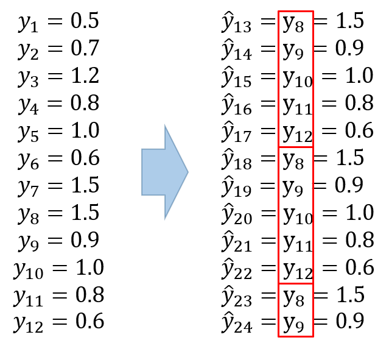

```{r setup, include=FALSE}
knitr::opts_chunk$set(echo = TRUE)
options(width=200)
```

- Data 출처 : [Data Mining for Business Analytics](https://www.dataminingbook.com/book/r-edition)에서 사용한 미국 철도 회사 “Amtrak”에서 수집한 1991년 1월~2004년 3월까지 매달 환승 고객 수

-----------

# **Introduction**

STLM은 STL (Seasonal and Trend decomposition using Loess) 분해를 이용하여 시계열자료를 `계절 성분(Seasonal Component)` $S_{t}$와 `추세 + 오차 성분 (Seasonally Adjusted Component)` $A_{t}$로 분해한 후 각각 예측하여 더한 값을 최종 예측으로 사용한다. 즉, $y_{t}=S_{t} + A_{t}$. 

------

# **예제**

- Ridership on Amtrak Trains(미국 철도 회사 “Amtrak”에서 수집한 1991년 1월~2004년 3월까지 매달 환승 고객 수) 예제를 이용하여 BSTS이 실제 데이터에 어떻게 적용되는지 설명한다.


```{r}
# Data 불러오기

Amtrak.data <- data.table::fread(paste(getwd(),"Amtrak.csv", sep="/"))
```

```{r}
ridership.ts <- ts(Amtrak.data$Ridership, start=c(1991,1), end=c(2004,3), freq=12)
train.ts     <- window(ridership.ts,start=c(1991,1), end=c(2001,3))   # Training Data
test.ts      <- window(ridership.ts,start=c(2001,4))                  # Test Data
n.test       <- length(test.ts)

```

------

## **분해 (Decomposition)**

- 시계열은 다양한 패턴으로 나타날 수 있다. (추세, 계절성 등)
- 시계열을 몇 가지 성분으로 나누는 작업은 시계열을 이해하는데 종종 도움이 된다.
- R 함수 `decompose()`를 이용하여 데이터를 추세와 계절성, 불규칙 성분으로 나눌 수 있다.


```{r}
plot(decompose(train.ts), yax.flip=TRUE)
```


------

## **적합**

stlm은 `추세 + 오차 성분`에 `ETS, ARIMA 등과 같은 모형을 적합`시키고 `계절 성분은 계절 성분이 변하지 않거나 엄청나게 느리게 변하는 상황을 보통 가정`하기 때문에 관측된 계절 성분이 그대로 사용된다. 그래서 최종 적합값은 두 적합값을 더한 것이 된다.


```{r}
pacman::p_load("forecast", "dplyr")

fit.stlm <- train.ts %>%
  stlm(method = "arima")                  # 시계열을 분해하고 Trend + Error부분을 모형 적합
```


------

## **예측**

`추세 + 오차 성분에 ETS, ARIMA 등과 같은 모형을 적합시킨 것을 이용`하여 `forecast` 함수를 이용해 예측하고 `계절 성분은 Seasonal Naïve Method을 이용해 예측`한다. 

--------

### **Seasonal Naïve Method**

- 예측값 = 같은 계절(Season)의 마지막 관측값
   - $\hat{y}_{T+h|T}=y_{T+h-m(k+1)}$
     - $m$ : 계절성의 주기 (Seasonal Period)
     - $k$ : $(h-1)/m+1$의 정수 부분

<center></center>

<br />     

--------

```{r}
Forcast.stlm <- forecast(fit.stlm, h = n.test)    # Trend + Error부분을 예측하고 Seasonal naive method(같은 시즌의 마지막 관측값=예측)를 이용하여 Seasonal 예측하여 더함
Forcast.stlm$mean

par(mfrow=c(1,1))
plot(Forcast.stlm)

```

